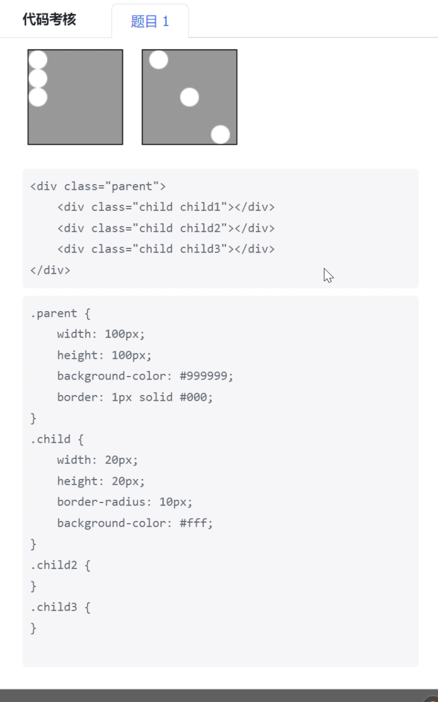
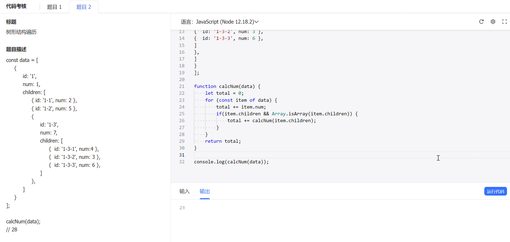

1. 自我介绍并说一下最近的这个项目，觉得哪里有一些复杂度比较高的，你可以详细聊聊
2. 这个项目是你实习做的吗？还是你自己练习的项目？（我说是老师项目组的）
3. 我看你了解的知识面还挺广的，你是通过哪些方式进行前端的学习的？（GitHub、B站、掘金、极客时间）
4. 有没有做过系统一点的学习？比如书籍之类的（我说你不知道的JavaScript）
5. 这本书有什么理念，或者说你觉得印象比较深刻的？（说了this，把 this 全部过一遍）
6. 那你在实际项目中有哪些场景有用this去做一些方案，或者说做一些小的工具函数之类的？（我说有，比如单例模式，然后全部过一遍）
7. 那单例模式，你是在什么样的一个场景里面去用的？为什么会选择单例模式？有什么优缺点？
8. 你刚刚说扩展性比较差，弹簧组件是全局的，那假设另外一个场景也需要使用这个组件，但是它又要有些不一样，那这个时候你会用到什么设计模式呢？
9. 我看你项目写了响应式布局，你是之前做过移动端吗？（我说有）
10. 那你是怎么做的适配的？因为有高倍屏、低倍屏，还有些手机尺寸不一样。
11. 你所有的布局都是用的 px 去进行布局的吗？（我说还有 rem）
12. 那你觉得 rem 的值应该设置为多少呢？（我说是除以10，追问，我说在GitHub上面阿里源码扒下来的）
13. 对于样式布局，你了解哪些方式呢？（我说有 flex弹性布局、grid网格布局、table表格布局、定位布局、浮动布局） 哪种用的比较多呢？（我说flex弹性布局）
14. 那你可以说一些 flex 的样式属性吗？（我说有flex-direction、flex-wrap、flex-justify、flex-align、flex: 1）
15. 听到我说 flex 布局，面试官扔了到题目过来：用 flex 布局完成从左边的到右边的效果

16. 手撕树形结构遍历：要求最后的结果为 28

17. 继续回归项目：对于 jwt 认证保障的话，你可以说一下它大致怎么实现的呢？
18. token 你是存在哪里的？（我说存在 localStorage 中） 为什么存在 localStorage 中？（我说一开始是想放在 cookie 中，但是刚好接触了 axios，然后进行封装，更方便）
19. 你这7天过期的逻辑放在 localStorage 中是怎么做的呢？（我说我设计了长 token 和短 token） 面试官说这个方式没见过，比较有意思😄
20. 短 token 过期，前端拦截到错误然后用长token做请求，那你这个逻辑岂不是接口会做一个重试的逻辑？那如果长 token 也过期了，那这个时候你会怎么做？（我说会跳转到登录界面，重新登录）
21. 跳转界面是在前端还是后端做的重定向？（我说是在前端，axios 封装，错误码）
22. 你前端做重定向的时候，你是通过什么样的一个 API 去做的？（我说是 window.location.href('/login')） 那你这种方式跟 location.replace('/login')、location.push('/login') 有什么区别吗？（我说 window.location.href('/login') 是会刷新页面的，而 location.replace('/login') 是不会刷新页面的）
23. 你点的浏览器回退，你还是可以回到上一个地址吗？（我说直接退出到登录界面）
24. 我看你另外一个项目设计了一个拖拽式布局，你可以说一下会用到哪些API吗？还是说你这个功能是通过第三方库实现的？（我说原来是自己写的，后面效果不是特别好，就用了第三方库，在 npm 上的 Allotment） 那如果让你用原生 JS，你知道要用到哪些 API 呢？（我说 mouseDown、mouseMove、mouseUp、mouseOut，监听鼠标的点击事件，获取鼠标的坐标，计算容器的宽度）
25. 面试官说前端基础就面到这，我心想这还只是基础吗😭，然后反问：
    - 面试表现（提了一嘴 AI，平时有用过什么 AI 工具吗？）
    - 面试官说可以系统学习，多看书籍，知识点比较零散
    - TikTok 到底是负责什么的
    - 贵公司技术栈